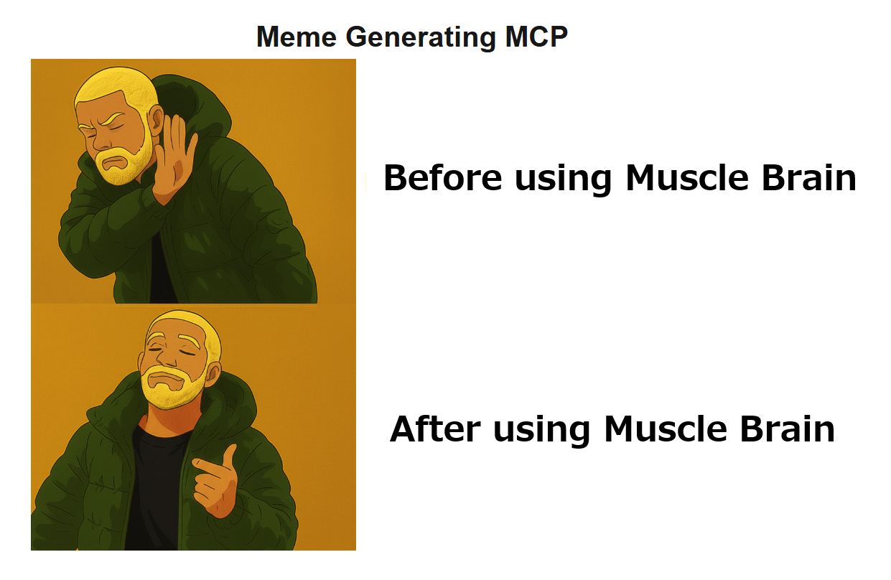
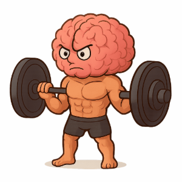
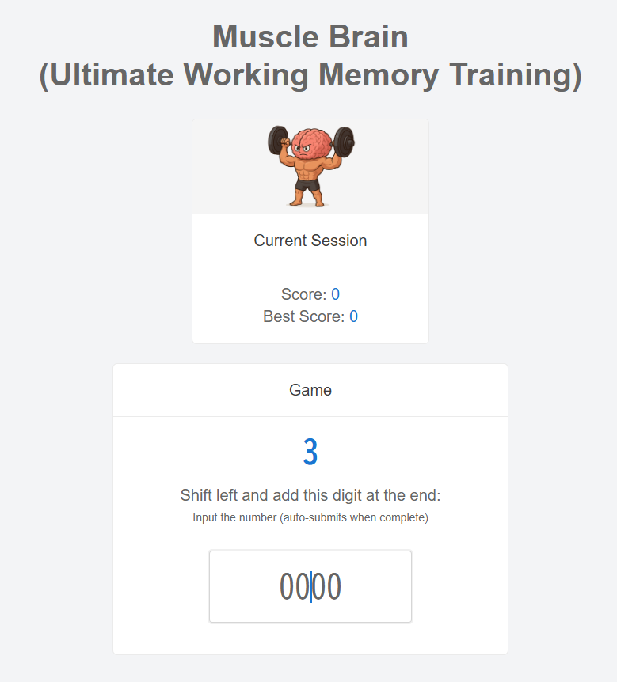
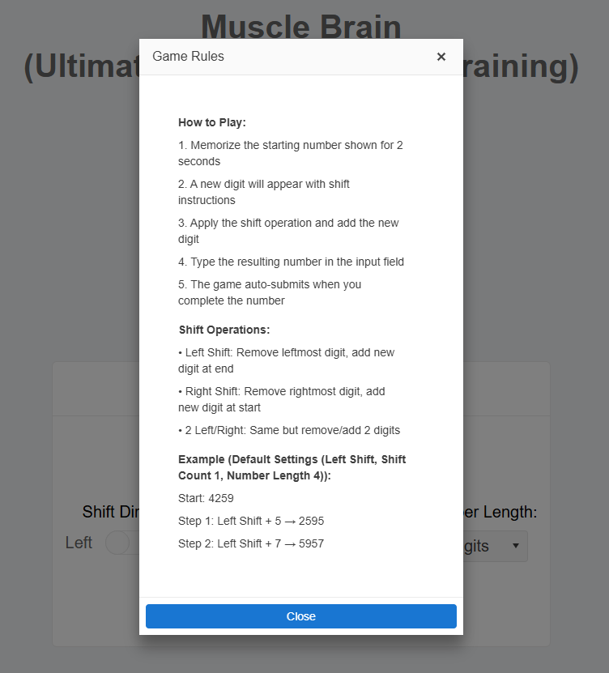
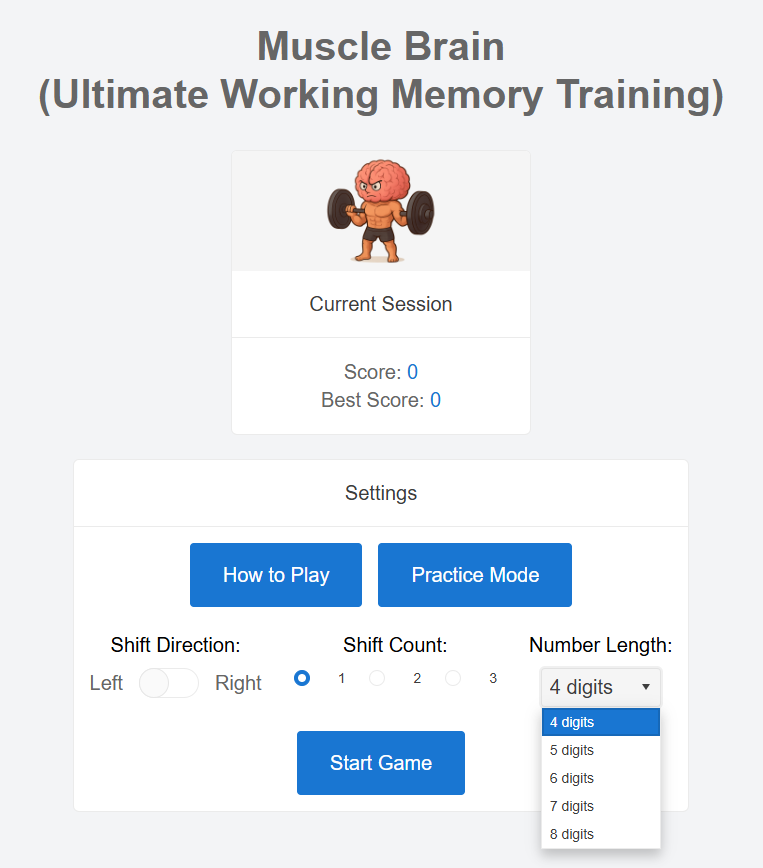
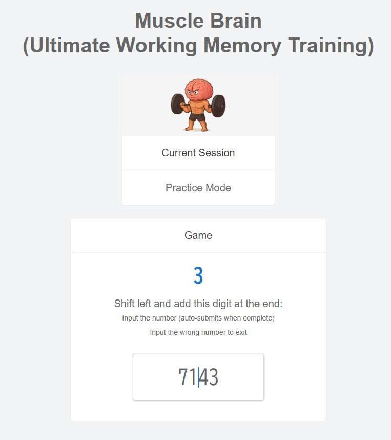
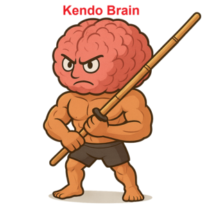

## What I Built

### Intro

Web developer is a really hard job especially before the deadline. No matter how early you do your tasks, new tasks and new bugs keeps appearing endlessly. I really get exhausted!😇 So I was trying to improve my work by using AI and test automation as I wrote in my posts before.🧠

↓ 🎭How to test Next.js SSR API (Playwright + MSW) Part 2 Parallel test🎭  
https://dev.to/webdeveloperhyper/how-to-test-nextjs-ssr-api-playwright-msw-part-2-parallel-test-3akj

↓ **🧠**How to use AI more efficiently for free (Serena MCP)🧐  
https://dev.to/webdeveloperhyper/how-to-use-ai-more-efficiently-for-free-serena-mcp-5gj6

One day I realized that **improving myself** would also be a good way to stop freaking out before the deadline.🦸 And this is how my long journey of creating a brand training game began.🚀

### What is Working Memory?

There are many ways to train our brain, but this time I focus on improving our **Working Memory**.🧠 Working Memory is a short time memory used when we are doing tasks. It is often compared to a RAM (Random Access Memory) in a PC, or a table inside your head. So, the bigger the working memory is the better you can proceed with your tasks.

With high working memory we can:  
🙆 Handle **difficult and long** code easily.🤖  
🙆 Handle **multiple tasks** easily, and switch smoothly between several projects and sudden work.🤯  
🙆 Handle words and images in our brain easily, and become creative so come up with a good idea for **Meme Monday**.💡  

↑ 🧠🥷How to make Meme Generating MCP (Cline and Cursor)  
https://dev.to/webdeveloperhyper/how-to-make-meme-generating-mcp-cline-and-cursor-3mpo

### How to improve your Working Memory

**N-back** is a famous game to improve Working Memory. You have to remember and answer Nth number back. The effect of this game is medically proven, but the problem is, it is so boring!😴 So I made a working memory training game that has the similar theory. And, this is how **Muscle Brain (Ultimate Working Memory Training)** was born.👶

### Mr. Brain - Hero for Everyone −

I created an attractive character **Mr. Brain** for this game. He can lift heavy barbell every 1 second endlessly. Unbelievable!🫨 Up, down, up, down, up, down… Looking at Mr Brain pushing his muscle to his limit rhythmically will absolutely motivate us to continue the game and save the day.💯  


### How to play this Game

Let's take a look at how the game goes on.🔍 I will explain the default setting (left shift 1 and 4 digits).  
1️⃣ 4 digit initial number is displayed for 2 seconds. (e.g. 2548)  
2️⃣ 1 digit new number is displayed. (e.g. 3)  
3️⃣ Delete the first number of the 4 digits initial number, and add 1 digit new number at the end. (e.g. ~~2~~548+3)  
4️⃣ Repeat 2️⃣ and 3️⃣ until you burn out and fail.🤯  
This simple but has the essential method of working memory training will definitely boost your working memory and save the day.💯


### Heart Warming Explanation🫶

Cannot remember the rule? Don't worry!🦸 I also added an instruction in the game. Push the "How to Play" button on the start page, and a heart warming instruction modal will pop out powerfully to support you.


### Game Setting

For beginners, I recommend starting with the default setting. But for people who really what to improve their working memory from the bottom of heart, you can change all the parameter at the start page.

| Item            | Options                |
| --------------- | ---------------------- |
| Shift Direction | Left(default), Right   |
| Shift Count     | 1(default), 2, 3       |
| Number Length   | 4(default), 5, 6, 7, 8 |

This setting system totally unlock the door for everyone to enhance their working memory efficiently.💯


### Practice Mode

Are you afraid of not doing the game well for the first time? Don't worry!🦸 I also made a Practice Mode. In this mode, the answer is already displayed in the input box, so you can learn the rules quickly and start the game with no worries. Beginner friendly.🤝


### Smooth keyboard navigation.

First, I made this game play with only mouse control. But I realize that adding keyboard navigation would improve user experience and added it afterword. Now you don't have to go back and forth between mouse and keyboard, and you can concentrate more when playing.🙆

| Without Keyboard Navigation🙅                                 | With Keyboard Navigation🙆                                         |
| ------------------------------------------------------------- | ------------------------------------------------------------------ |
| Need "Mouse Click" to choose "Shift Direction Switch".        | "Space Key" or "Mouse Click" to choose "Shift Direction Switch".   |
| Need "Mouse Click" to choose "Shift Count Radio Button".      | "Space Key" or "Mouse Click" to choose "Shift Count Radio Button". |
| Need "Mouse Click" for "Start Game" button.                   | Directly pushing "Enter Key" will start the game immediately .     |
| Need to push "Submit" button after answering the last number. | Auto submit after answering the last number.                       |

### Code Secrets🤫

All the components are made by **KendoReact**. Owing to KendoReact I could create a good looking and functional game speedily. The documentation of KendoReact was written in detail with code that actually work and easy to understand. Thank you very much for creating a wonderful library!



## Demo

### Live Project on Vercel

https://muscle-brain-bay.vercel.app/

### Code Repository

https://github.com/webdeveloperhyper/muscle-brain

## KendoReact Components Used

| Packages                           | Components                            |
| ---------------------------------- | ------------------------------------- |
| @progress/kendo-react-buttons      | Button                                |
| @progress/kendo-react-inputs       | Input, RadioButton, Switch            |
| @progress/kendo-react-dropdowns    | DropDownList                          |
| @progress/kendo-react-labels       | Label                                 |
| @progress/kendo-react-layout       | Card, CardHeader, CardBody, CardImage |
| @progress/kendo-react-notification | Notification, NotificationGroup       |
| @progress/kendo-react-animation    | Fade                                  |
| @progress/kendo-react-common       | Navigation, Typography                |
| @progress/kendo-react-dialogs      | Dialog, DialogActionsBar              |
| @progress/kendo-theme-default      | -                                     |

Total: 17 KendoReact Components Used

## Getting Started

### Installation

1️⃣ Clone the repository

```bash
git clone https://github.com/webdeveloperhyper/muscle-brain.git
cd muscle-brain
```

2️⃣ Install dependencies

```bash
npm install
```

3️⃣ Run the development server

```bash
npm run dev
```

4️⃣ Open http://localhost:3000 in your browser

### Tech Stack

- **Framework:** Next.js 15.5.3
- **UI Library:** KendoReact
- **Language:** TypeScript
- **Styling:** CSS-in-JS + Tailwind CSS
